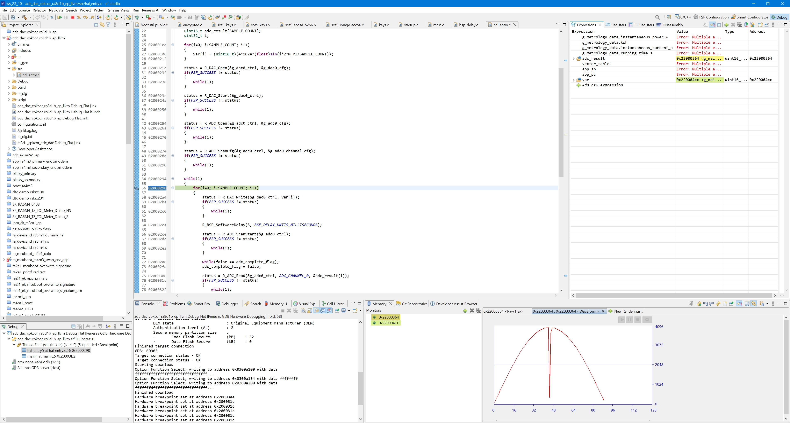

## 1.参考例程概述
该示例项目演示了基于瑞萨 FSP 的瑞萨 RA MCU 上 ADC和DAC驱动程序的基本功能。DAC持续输出sin(x)对应的电平，ADC采样该输出值并保存在数组adc_result[]中。

### 1.1 创建新工程，BSP选择“CPK-RA8D1B Core Board”
### 1.2 Stack中添加“ADC (r_adc)”和“ADC (r_dac)”，详细的属性设置请参考例程

### 1.3 将板上的P004和P015用杜邦线连接。

### 1.4 调试代码，找到数组adc_result在memory中的地址，在memory窗口打开相应地址。利用New Renderings添加waveform，观测变量。配置如下图所示：

### 1.5
实际调试时界面如下所示，adc_result[]数组的内容也描出一条正弦的半周期：

## 2. 支持的电路板：
CPKCOR-RA8D1B

## 3. 硬件要求：
1块瑞萨 RA核心板：CPKCOR-RA8D1B

1根Type-C USB 数据线

## 4. 硬件连接：
通过Type-C USB 电缆将 CPKCOR-RA8D1B板上的 USB 调试端口（JDBG）连接到主机 PC。